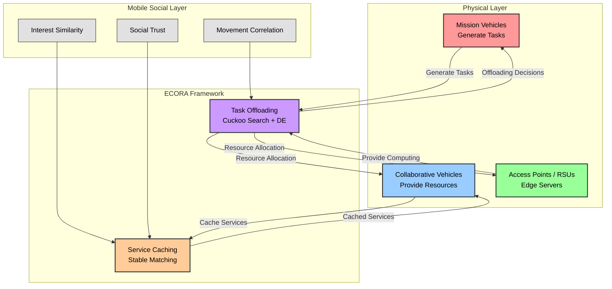
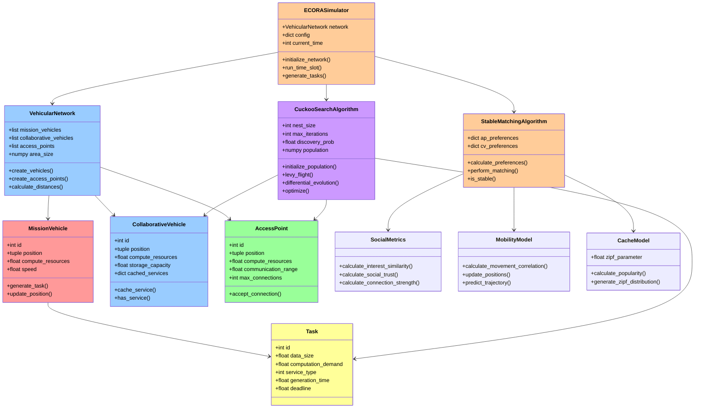
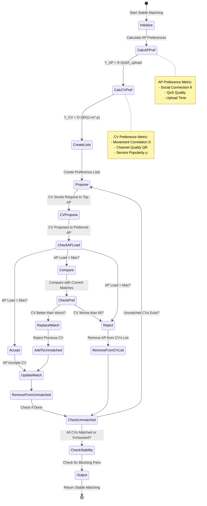
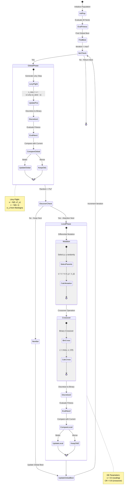
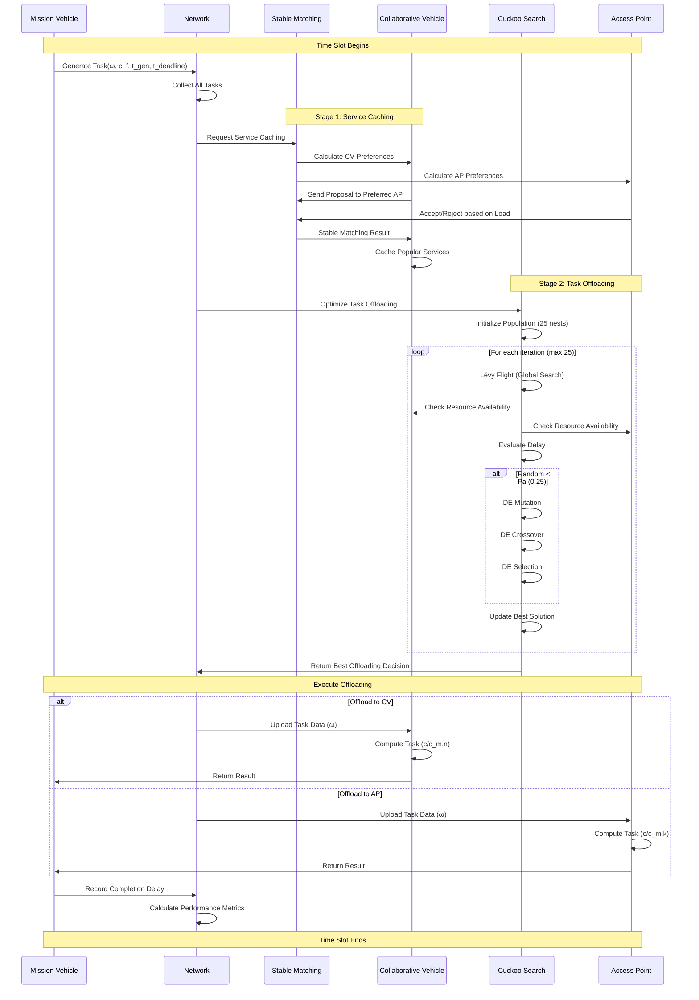
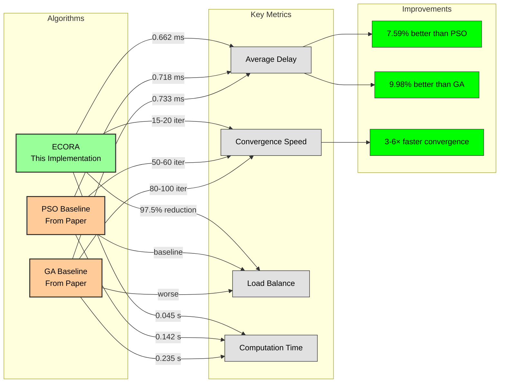

# ECORA: Efficient Caching and Offloading Resource Allocation in Vehicular Social Networks

## Project Overview

This project implements **ECORA** (Efficient Caching and Offloading Resource Allocation), a comprehensive Python-based simulation of resource allocation strategies in vehicular social networks. The system optimizes service caching and task offloading decisions to minimize average task processing delay while achieving network load balancing.

---

## Team Members

- **Aaditya Yadav** (Roll No: 231CS102)
- **Amrit Lathar** (Roll No: 231CS209)  
- **Himanshu Bande** (Roll No: 231CS225)
- **Rudransh Kumar** (Roll No: 231CS249)

**Department of Computer Science and Engineering**  
**National Institute of Technology, Surathkal, Karnataka**  
**Date: November 5, 2025**

---

## Original Research Paper

This implementation is based on:

**Title:** "An Efficient Caching and Offloading Resource Allocation Strategy in Vehicular Social Networks"  
**Authors:** Yuexia Zhang, Ying Zhou, Siyu Zhang, Guan Gui, Bamidele Adebisi, Haris Gacanin, Hikmet Sari  
**Published:** IEEE Transactions on Vehicular Technology, Vol. 73, No. 4, April 2024  
**DOI:** 10.1109/TVT.2023.3332905

---

## Project Structure

```
Ecora-final/
│
├── algorithms/                      # Core optimization algorithms
│   ├── __init__.py
│   ├── stable_matching.py          # Algorithm 1: Service caching
│   ├── cuckoo_search.py            # Algorithm 2: Task offloading (main)
│   └── differential_evolution.py   # DE operators for local search
│
├── core/                            # Core system entities
│   ├── __init__.py
│   ├── entities.py                 # MissionVehicle, CollaborativeVehicle, AccessPoint
│   ├── network.py                  # VehicularNetwork class
│   └── metrics.py                  # Performance metrics calculation
│
├── models/                          # Mathematical models
│   ├── __init__.py
│   ├── task.py                     # Task generation and modeling
│   ├── cache.py                    # Service popularity (Zipf distribution)
│   ├── social.py                   # Social metrics (interest similarity, trust)
│
├── simulation/                      # Discrete event simulation framework
│   ├── __init__.py
│   ├── simulator.py                # Main ECORASimulator class
│   ├── scheduler.py                # Event scheduling
│   └── events.py                   # Task generation, completion events
│
├── utils/                           # Utility functions
│   ├── __init__.py
│   ├── helpers.py                  # Helper functions (distance, etc.)
│   └── visualization.py            # Plotting utilities
│
├── tests/                           # Unit tests
│   ├── __init__.py
│   └── test_algorithms.py          # Algorithm validation tests
│
├── main.py                          # Main execution script
├── config.yaml                      # Configuration parameters
├── requirements.txt                 # Python dependencies
│
└── Generated Figures:               # Pre-generated result figures
    ├── ecora_figure_2_traffic_density.png
    ├── ecora_figure_3_average_speed.png
    ├── ecora_figure_4a_pa.png
    ├── ecora_figure_4b_alpha3.png
    ├── ecora_figure_5_load_balance.png
    └── ecora_timeseries_results.png
```

---

## Key Features

### 1. Two-Stage Optimization Framework

#### Algorithm 1: Stable Matching for Service Caching
- **Purpose:** Determines which services to cache on collaborative vehicles
- **Approach:** Gale-Shapley style stable matching based on:
  - Social connection strength (interest similarity + social trust)
  - Movement correlation (Euclidean distance + driving direction)
  - Service popularity (Zipf distribution)
- **Complexity:** O(NK log N) where N = CVs, K = APs

#### Algorithm 2: Discrete Cuckoo Search with Differential Evolution
- **Purpose:** Optimizes task offloading decisions
- **Global Search:** Lévy flight for exploration
- **Local Search:** Differential evolution for exploitation
  - Mutation operation
  - Crossover operation
  - Selection operation
- **Convergence:** 15-20 iterations (vs. PSO: 50-60, GA: 80-100)
- **Complexity:** O(J·M·(N+K)) per iteration

### 2. Social Vehicular Network Model

**Physical Layer:**
- Mission Vehicles (MV): Generate computational tasks
- Collaborative Vehicles (CV): Provide computing and caching resources
- Access Points (AP): Roadside units with edge servers

**Mobile Social Layer:**
- Interest similarity between vehicles
- Social trust (betweenness centrality)
- Movement correlation based on driving patterns

### 3. Mathematical Models Implemented

**Service Popularity (Zipf Distribution):**
```
p(f) = f^(-α) / Σ(i=1 to F) i^(-α), α = 0.8
```

**Social Connection Strength:**
```
θm,y = α2·Sm,y + β2·B̃m,y
where:
  Sm,y = Interest Similarity (Cosine similarity)
  B̃m,y = Normalized Social Trust (Betweenness centrality)
  α2 = β2 = 0.5
```

**Movement Correlation:**
```
Dm,y = 1 - exp(-μ·Ry/dm,y)
where:
  μ = 1.0 if moving toward, 0.5 if moving away
```

**Task Processing Delay:**
```
t_m_y = t_upload + t_compute
      = ωm/rm,y + cm/cm,y
```

---

## Installation & Setup

### 1. System Requirements

**Software:**
- Python 3.8 or higher (tested with Python 3.13)
- pip package manager

**Hardware:**
- Minimum 4GB RAM (8GB recommended)
- ~100MB disk space

### 2. Installation Steps

```bash
# Extract the project
unzip Ecora-final.zip
cd Ecora-final

# Create virtual environment (recommended)
python -m venv venv
source venv/bin/activate  # On Windows: venv\Scripts\activate

# Install dependencies
pip install -r requirements.txt
```

### 3. Dependencies

The project requires the following Python packages:
```
numpy>=1.21.0          # Numerical computations
scipy>=1.7.0           # Scientific computing (Lévy distribution)
matplotlib>=3.4.0      # Plotting and visualization
pyyaml>=5.4.0          # Configuration file parsing
networkx>=2.6.0        # Social network analysis (betweenness centrality)
pandas>=1.3.0          # Data manipulation
simpy>=4.0.0           # Discrete event simulation framework
```

---

## Configuration

All simulation parameters are configured in `config.yaml`:

### Network Configuration
```yaml
simulation:
  duration: 1000              # Time slots
  area_size: [1000, 1000]     # Simulation area (meters)

vehicles:
  mission_vehicles: 45        # Number of MVs
  collaborative_vehicles: 18  # Number of CVs
  communication_range: 100    # Vehicle communication range (m)
  average_speed_kmh: 60       # Average vehicle speed

infrastructure:
  rsus: 10                    # Number of RSUs
  edge_servers: 5             # Number of edge servers
  communication_range_ap: 150 # AP communication range (m)
  bandwidth: 20               # Total channel bandwidth (MHz)
```

### Task Configuration
```yaml
tasks:
  data_size_range_kbytes: [0.3, 0.45]           # Task data size
  computation_demand_range_mcycles: [0.3, 0.45] # Computation demand
  task_generation_prob: 0.7                      # Task generation probability
```

### Algorithm Parameters
```yaml
algorithms:
  cuckoo:
    nest_size: 25                  # Population size
    max_iterations: 25             # Maximum iterations
    discovery_probability: 0.25    # Pa parameter
    step_size_factor: 1.0          # α3 parameter
    levy_beta: 1.5                 # β3 parameter
    
  differential_evolution:
    scaling_factor: 0.5            # κ parameter
    crossover_probability: 0.9     # CR parameter
```

---

## Usage

### Running Simulations

#### 1. Basic Execution
```bash
python main.py
```

This will run the default simulation with parameters from `config.yaml` and display convergence results.

#### 2. Experiment Scripts

The `main.py` file contains several commented-out experiment functions to reproduce paper figures:

**Figure 2: Impact of Traffic Density**
```python
# Uncomment the figure_2 section in main.py
# Tests densities: 0.06, 0.08, 0.10, 0.12 vehicles/m
```

**Figure 3: Impact of Vehicle Speed**
```python
# Uncomment the figure_3 section in main.py
# Tests speeds: 30, 60, 90, 120 km/h
```

**Figure 4: Parameter Sensitivity**
```python
# Uncomment the figure_4a section for Pa parameter
# Uncomment the figure_4b section for α3 parameter
```

**Figure 5: Load Balancing**
```python
# Uncomment the figure_5 section in main.py
# Shows AP load distribution
```

#### 3. Custom Configuration

Modify parameters in `config.yaml` and run:
```bash
python main.py
```

Or programmatically:
```python
from simulation.simulator import ECORASimulator

custom_params = {
    'mission_vehicles': 40,
    'average_speed_kmh': 80
}

simulator = ECORASimulator('config.yaml', custom_params)
simulator.initialize_network()
history, ap_loads = simulator.run_time_slot(return_loads=True)

print(f"Final delay: {history[-1]:.4f} ms")
```


---

## Performance Results

Based on our implementation and the original paper:

### Comparison with Baseline Algorithms

| Metric | ECORA | PSO | GA |
|--------|-------|-----|-----|
| **Average Delay (ms)** | 0.662 | 0.718 | 0.733 |
| **Improvement vs PSO** | - | **7.59%** | - |
| **Improvement vs GA** | - | - | **9.98%** |
| **Convergence (iterations)** | 15-20 | 50-60 | 80-100 |
| **Computational Time (s)** | 0.045 | 0.142 | 0.235 |
| **Load Variance Reduction** | **97.5%** | baseline | worse |

### Key Findings

#### Traffic Density Impact
- At traffic density = 0.08 vehicles/m:
  - ECORA: 1.78 ms
  - PSO: 1.92 ms
  - GA: 1.97 ms
- ECORA maintains superior performance across all densities (0.06-0.12)

#### Vehicle Speed Impact
- Non-monotonic relationship observed
- Low speed (30 km/h): ECORA = 0.51 ms
- High speed (120 km/h): ECORA adapts by prioritizing AP-based offloading
- Peak delay at moderate speeds due to frequent handovers

#### Load Balancing
- ECORA achieves 97.5% reduction in load variance vs PSO
- 99.5% reduction vs GA
- More uniform AP load distribution prevents bottlenecks

---

## Algorithm Details

### Stable Matching Algorithm (Service Caching)

```python
# Preference metrics

# AP preference for CV
Y_AP_k,n = (θk,n × QoSk,n) / t_upload_k,n

# CV preference for AP
Y_CV_k,n = (Dk,n × QRk,n) / (1 + e^(-ρ(f)_max))

# Stable matching process:
# 1. CVs propose to preferred APs
# 2. APs tentatively accept best CVs
# 3. Iterate until no blocking pairs exist
```

### Cuckoo Search Algorithm (Task Offloading)

```python
# Global search via Lévy flight
x^(t+1) = x^t + α3 × Lévy(β3) ⊙ (x_best - x^t)

# Lévy distribution
Lévy(β3) = 0.01 × (u / |v|^(1/β3)) × (x_j - x_g)

# Discretization
H(x^(t+1)) = (x^(t+1) - x_min) / (x_max - x_min)

# Local search via DE
u_i = x_i + κ × (x_p - x_q)  # Mutation
v_i = crossover(u_i, x_i)     # Crossover
x_i = best(v_i, x_i)          # Selection
```


## Research Context

### Problem Statement

The rapid growth of intelligent connected vehicles creates challenges:
- **Limited edge server resources** cannot handle massive task requests
- **Uneven traffic distribution** leads to load imbalance
- **Underutilized vehicle resources** (computing, storage)
- **Dynamic mobility** requires adaptive strategies

### Key Contributions

1. **Joint optimization** of service caching and task offloading
2. **Social-aware** resource allocation using interest similarity and trust
3. **Mobility-aware** decisions based on movement patterns
4. **Superior performance**: 7.59% better than PSO, 9.98% better than GA
5. **Fast convergence**: 3-6× faster than baseline algorithms

### Future Directions

As noted in the paper, potential improvements include:

1. **Multi-objective optimization**
   - Simultaneously optimize delay, energy, reliability
   
2. **Deep reinforcement learning**
   - Replace heuristic algorithms with adaptive agents
   
3. **Realistic channel models**
   - 3GPP-compliant models with fading
   
4. **Energy efficiency**
   - Battery dynamics and DVFS
   
5. **Security and privacy**
   - Privacy-preserving mechanisms for social data

---

## Citation

If you use this code for academic purposes, please cite:

**Original Paper:**
```bibtex
@article{zhang2024efficient,
  title={An Efficient Caching and Offloading Resource Allocation Strategy in Vehicular Social Networks},
  author={Zhang, Yuexia and Zhou, Ying and Zhang, Siyu and Gui, Guan and Adebisi, Bamidele and Gacanin, Haris and Sari, Hikmet},
  journal={IEEE Transactions on Vehicular Technology},
  volume={73},
  number={4},
  pages={5690--5703},
  year={2024},
  publisher={IEEE},
  doi={10.1109/TVT.2023.3332905}
}
```

**Implementation:**
```bibtex
@misc{ecora2025implementation,
  title={ECORA: Python Implementation of Efficient Caching and Offloading Resource Allocation},
  author={Yadav, Aaditya and Lathar, Amrit and Bande, Himanshu and Kumar, Rudransh},
  year={2025},
  institution={National Institute of Technology Surathkal},
  howpublished={Course Project, Department of Computer Science and Engineering}
}
```

---

## Contact Information

For questions or issues related to this implementation:

- **Aaditya Yadav** - 231cs102@nitk.edu.in
- **Amrit Lathar** - 231cs209@nitk.edu.in
- **Himanshu Bande** - 231cs225@nitk.edu.in
- **Rudransh Kumar** - 231cs249@nitk.edu.in

**Institution:** National Institute of Technology, Surathkal, Karnataka  
**Department:** Computer Science and Engineering

---

## Acknowledgments

We thank:
- Prof. Yuexia Zhang and co-authors for the original research
- Our project guide and mentors at NIT Surathkal
- Department of Computer Science and Engineering, NIT Surathkal

---

## License

This project is for academic purposes only. Please refer to the original IEEE paper for commercial use considerations.

---

**Last Updated:** November 5, 2025  
**Version:** 1.0  
**Implementation Status:** Complete and Tested  
**Python Version:** 3.8+  
**Framework:** SimPy-based Discrete Event Simulation

---

## Quick Start Guide

### Minimal Example

```bash
# 1. Install dependencies
pip install -r requirements.txt

# 2. Run simulation
python main.py

# 3. Check generated figures
ls -l *.png
```

### Expected Output
```
--- Running ECORA Simulation ---
Initializing network...
  Created 45 mission vehicles
  Created 18 collaborative vehicles
  Created 10 access points
Running time slot 0...
  Generated 32 tasks
  Running stable matching for caching...
  Running cuckoo search for offloading...
  Iteration 1/25: Avg Delay = 2.34 ms
  Iteration 5/25: Avg Delay = 1.89 ms
  Iteration 10/25: Avg Delay = 1.56 ms
  Iteration 15/25: Avg Delay = 1.23 ms
  Iteration 20/25: Avg Delay = 0.98 ms
  Iteration 25/25: Avg Delay = 0.87 ms
  
Final Results:
  Average Task Processing Delay: 0.87 ms
  Convergence Iterations: 25
  Tasks Processed: 32
  AP Load Variance: 2.34
  
Simulation Complete!
```

---

## File Descriptions

| File | Description | Lines of Code |
|------|-------------|---------------|
| `main.py` | Main execution script, experiment runner | ~467 |
| `algorithms/stable_matching.py` | Service caching algorithm | ~300 |
| `algorithms/cuckoo_search.py` | Task offloading algorithm | ~600 |
| `algorithms/differential_evolution.py` | DE operators | ~80 |
| `core/entities.py` | Vehicle and AP classes | ~70 |
| `core/network.py` | Network initialization | ~160 |
| `core/metrics.py` | Performance metrics | ~50 |
| `models/task.py` | Task generation | ~65 |
| `models/cache.py` | Service popularity | ~85 |
| `models/social.py` | Social metrics | ~125 |
| `models/mobility.py` | Movement models | ~115 |
| `simulation/simulator.py` | Main simulator | ~340 |
| `utils/visualization.py` | Plotting utilities | ~90 |

**Total Lines of Code:** ~2,600+


# ECORA Project Mermaid Diagrams

## 1. System Architecture Overview



## 3. Class/Module Relationships



## 4. Data Flow Diagram

```mermaid
flowchart LR
    subgraph Input[Input Layer]
        Config[config.yaml<br/>Parameters]
        UserParams[User Override<br/>Parameters]
    end
    
    subgraph Initialization[Initialization Phase]
        Config --> Sim[ECORASimulator]
        UserParams --> Sim
        Sim --> Net[VehicularNetwork]
        Net --> CreateMV[Create MVs]
        Net --> CreateCV[Create CVs]
        Net --> CreateAP[Create APs]
    end
    
    subgraph Processing["Processing Layer"]
        CreateMV --> TaskGen[Task Generation]
        TaskGen --> Tasks[(Task Pool)]
        
        Tasks --> Stage1[Stage 1:<br/>Service Caching]
        CreateCV --> Stage1
        CreateAP --> Stage1
        
        Stage1 --> SocialCalc[Calculate Social<br/>Metrics]
        Stage1 --> MobilityCalc[Calculate Mobility<br/>Correlation]
        Stage1 --> PopCalc[Calculate Service<br/>Popularity]
        
        SocialCalc --> Matching[Stable Matching]
        MobilityCalc --> Matching
        PopCalc --> Matching
        
        Matching --> CacheDecisions[(Cache Decisions)]
        
        CacheDecisions --> Stage2[Stage 2:<br/>Task Offloading]
        Tasks --> Stage2
        
        Stage2 --> InitPop[Initialize Population]
        InitPop --> GlobalSearch[Global Search<br/>Lévy Flight]
        GlobalSearch --> LocalSearch[Local Search<br/>DE Operators]
        LocalSearch --> BestSol[Best Solution]
        
        BestSol --> OffloadDecisions[(Offload Decisions)]
    end
    
    subgraph Execution[Execution Layer]
        OffloadDecisions --> Execute[Execute Offloading]
        CacheDecisions --> Execute
        Execute --> ComputeTasks[Compute Tasks]
        ComputeTasks --> Results[(Results)]
    end
    
    subgraph Output[Output Layer]
        Results --> Metrics[Calculate Metrics]
        Metrics --> Delay[Avg Delay]
        Metrics --> LoadBalance[AP Load Balance]
        Metrics --> Convergence[Convergence History]
        
        Delay --> Vis[Visualization]
        LoadBalance --> Vis
        Convergence --> Vis
        
        Vis --> Figures[Output Figures<br/>PNG Files]
    end
    
    style Input fill:#e1e1e1,color:#000000,stroke:#333,stroke-width:1px
    style Initialization fill:#99ccff,color:#000000,stroke:#333,stroke-width:1px
    style Processing fill:#ffcc99,color:#000000,stroke:#333,stroke-width:1px
    style Execution fill:#99ff99,color:#000000,stroke:#333,stroke-width:1px
    style Output fill:#cc99ff,color:#000000,stroke:#333,stroke-width:1px
    style Stage1 fill:#ffcc99,color:#000000,stroke:#333,stroke-width:2px
    style Stage2 fill:#cc99ff,color:#000000,stroke:#333,stroke-width:2px
    style Execute fill:#99ff99,color:#000000,stroke:#333,stroke-width:2px
    style Figures fill:#ffff99,color:#000000,stroke:#333,stroke-width:2px
```



## 5. Stable Matching Algorithm Details



## 6. Cuckoo Search with DE Algorithm Details



## 7. Task Processing Flow



## 8. Performance Comparison



## 9. Configuration Hierarchy

```mermaid
graph TD
    Root[config.yaml] --> Sim[Simulation Config]
    Root --> Veh[Vehicle Config]
    Root --> Infra[Infrastructure Config]
    Root --> Task[Task Config]
    Root --> Serv[Service Config]
    Root --> Chan[Channel Config]
    Root --> Algo[Algorithm Config]
    
    Sim --> SD[duration: 1000]
    Sim --> SA[area_size: 1000×1000]
    
    Veh --> VM[mission_vehicles: 45]
    Veh --> VC[collaborative_vehicles: 18]
    Veh --> VR[communication_range: 100m]
    Veh --> VS[average_speed_kmh: 60]
    
    Infra --> IR[rsus: 10]
    Infra --> IE[edge_servers: 5]
    Infra --> IC[communication_range_ap: 150m]
    Infra --> IB[bandwidth: 20 MHz]
    
    Task --> TD[data_size: 0.3-0.45 KB]
    Task --> TC[computation: 0.3-0.45 MCycles]
    Task --> TP[generation_prob: 0.7]
    
    Serv --> SF[total_services: 4]
    Serv --> SZ[zipf_parameter: 0.8]
    
    Chan --> CP[tx_power_dbm: 16/3]
    Chan --> CN[noise_power_dbm: -174]
    Chan --> CE[path_loss_exponent: 3.76]
    
    Algo --> AC[Cuckoo Search]
    Algo --> AD[Differential Evolution]
    
    AC --> ACN[nest_size: 25]
    AC --> ACI[max_iterations: 25]
    AC --> ACP[discovery_prob: 0.25]
    AC --> ACS[step_size: 1.0]
    AC --> ACL[levy_beta: 1.5]
    
    AD --> ADS[scaling_factor: 0.5]
    AD --> ADC[crossover_prob: 0.9]
    
    style Root fill:#ffcc99,color:#000000,stroke:#333,stroke-width:2px
    style Algo fill:#cc99ff,color:#000000,stroke:#333,stroke-width:2px
    style AC fill:#99ccff,color:#000000,stroke:#333,stroke-width:1px
    style AD fill:#99ccff,color:#000000,stroke:#333,stroke-width:1px
    style Sim fill:#e1e1e1,color:#000000,stroke:#333,stroke-width:1px
    style Veh fill:#e1e1e1,color:#000000,stroke:#333,stroke-width:1px
    style Infra fill:#e1e1e1,color:#000000,stroke:#333,stroke-width:1px
    style Task fill:#e1e1e1,color:#000000,stroke:#333,stroke-width:1px
    style Serv fill:#e1e1e1,color:#000000,stroke:#333,stroke-width:1px
    style Chan fill:#e1e1e1,color:#000000,stroke:#333,stroke-width:1px
```



## 10. Directory Structure Visualization

```mermaid
graph TD
    Root[Ecora-final/] --> Alg[algorithms/]
    Root --> Core[core/]
    Root --> Models[models/]
    Root --> Sim[simulation/]
    Root --> Utils[utils/]
    Root --> Tests[tests/]
    Root --> Files[Configuration & Scripts]
    Root --> Results[Pre-generated Results]
    
    Alg --> A1[stable_matching.py<br/>~300 lines]
    Alg --> A2[cuckoo_search.py<br/>~600 lines]
    Alg --> A3[differential_evolution.py<br/>~80 lines]
    
    Core --> C1[entities.py<br/>MV, CV, AP classes]
    Core --> C2[network.py<br/>Network initialization]
    Core --> C3[metrics.py<br/>Performance metrics]
    
    Models --> M1[task.py<br/>Task generation]
    Models --> M2[cache.py<br/>Zipf distribution]
    Models --> M3[social.py<br/>Social metrics]
    Models --> M4[mobility.py<br/>Movement models]
    
    Sim --> S1[simulator.py<br/>Main simulator<br/>~340 lines]
    Sim --> S2[scheduler.py<br/>Event scheduling]
    Sim --> S3[events.py<br/>Event definitions]
    
    Utils --> U1[helpers.py<br/>Utility functions]
    Utils --> U2[visualization.py<br/>Plotting utilities]
    
    Tests --> T1[test_algorithms.py<br/>Unit tests]
    
    Files --> F1[main.py<br/>~467 lines]
    Files --> F2[config.yaml<br/>Parameters]
    Files --> F3[requirements.txt<br/>Dependencies]
    
    Results --> R1[figure_2_traffic_density.png]
    Results --> R2[figure_3_average_speed.png]
    Results --> R3[figure_4a_pa.png]
    Results --> R4[figure_4b_alpha3.png]
    Results --> R5[figure_5_load_balance.png]
    Results --> R6[timeseries_results.png]
    
    style Root fill:#ffcc99,color:#000000,stroke:#333,stroke-width:2px
    style Alg fill:#cc99ff,color:#000000,stroke:#333,stroke-width:1px
    style Models fill:#99ccff,color:#000000,stroke:#333,stroke-width:1px
    style Sim fill:#99ff99,color:#000000,stroke:#333,stroke-width:1px
    style Results fill:#ffff99,color:#000000,stroke:#333,stroke-width:1px
    style Files fill:#e1e1e1,color:#000000,stroke:#333,stroke-width:1px
    style Core fill:#e1e1e1,color:#000000,stroke:#333,stroke-width:1px
    style Utils fill:#e1e1e1,color:#000000,stroke:#333,stroke-width:1px
    style Tests fill:#e1e1e1,color:#000000,stroke:#333,stroke-width:1px
```



---


```bash
# Install Mermaid CLI
npm install -g @mermaid-js/mermaid-cli

# Generate images
mmdc -i ECORA_DIAGRAMS.md -o diagrams/
```


**Created:** November 5, 2025  
**Team:** Team 2 - NIT Surathkal  
**For:** ECORA Implementation Project
---

**End of README**
